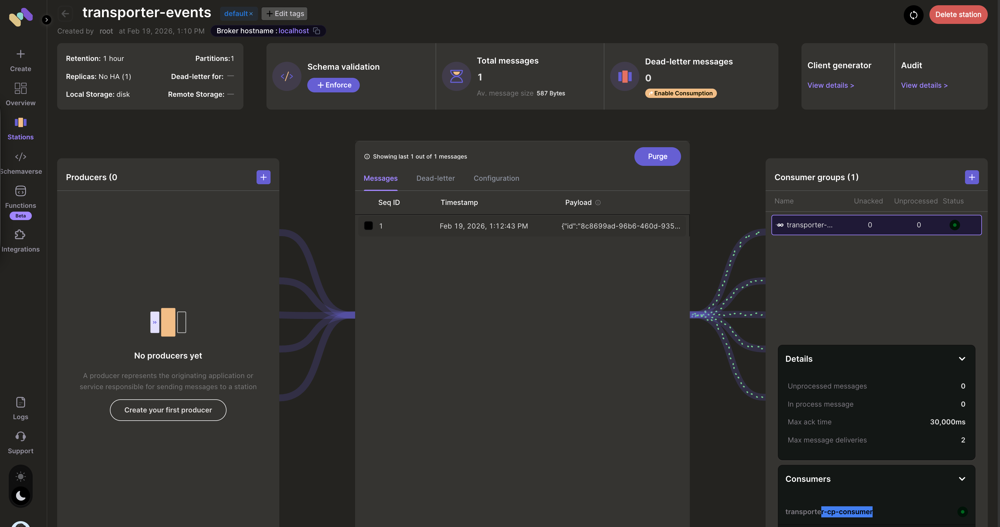

# Transporter - End-to-End Test Success! 🎉

**Date**: 2026-02-10 (Updated)
**Status**: ✅ MVP COMPLETE - Memphis Integration & Multi-Cluster Tested

## Screenshots

### Memphis UI - Event Successfully Consumed



Memphis station `transporter-events` showing the event consumed by `transporter-cp-consumer` (active, 0 unacked, 0 unprocessed).

---

## Test Summary

Successfully tested complete event-driven multi-cluster Kubernetes management flow with both HTTP and Memphis queue modes. Verified end-to-end event flow across separate clusters with connection token authentication.

## What Was Tested

### 1. Control Plane (CP)
- ✅ Deployed to separate kind cluster (`cp-cluster`) with Redis
- ✅ Memphis message queue integrated with PostgreSQL
- ✅ Memphis Go SDK v1.3.2 with connection token authentication
- ✅ WebSocket server accepting agent connections (NodePort 30080)
- ✅ HTTP `/events` endpoint accepting events
- ✅ Memphis event consumer receiving and routing events
- ✅ Event routing to target agents across clusters
- ✅ Health and metrics endpoints working

### 2. Data Plane Agent
- ✅ Deployed to separate kind cluster (`agent-cluster`)
- ✅ Connected to CP via cross-cluster WebSocket
- ✅ Registered with agent ID: `agent-cluster-agent-1`
- ✅ Heartbeat mechanism working
- ✅ Receiving events from CP in different cluster
- ✅ Executing Kubernetes operations

### 3. Event Producer
- ✅ CLI tool built and working
- ✅ HTTP mode for direct CP communication
- ✅ Memphis mode with connection token authentication
- ✅ Creates events from YAML manifests
- ✅ Publishes events to Memphis queue successfully

### 4. End-to-End Flow - HTTP Mode

```
Event Producer --HTTP POST--> Control Plane (cp-cluster) --WebSocket--> Agent (agent-cluster) --K8s API--> Cluster
```

**Test Case**: Create namespace via HTTP event

**Command:**
```bash
./bin/event-producer k8s \
  --agent agent-cluster-agent-1 \
  --manifest examples/manifests/namespace.yaml \
  --cp-url http://localhost:30080 \
  --mode http
```

**Result:** ✅ SUCCESS

**Event ID:** `test-event-1770722316`

**Event Flow Observed:**
1. Event Producer → CP `/events` endpoint
2. CP (cp-cluster) received event via HTTP
3. CP routed event to agent `agent-cluster-agent-1` (different cluster)
4. Agent (agent-cluster) executed multi-phase flow:
   - ✅ Received
   - ✅ Validating
   - ✅ Applying
   - ✅ Verifying
   - ✅ Completed
5. **Namespace created in agent-cluster!**

### 5. End-to-End Flow - Memphis Mode

```
Event Producer --Memphis Queue--> Control Plane (cp-cluster) --WebSocket--> Agent (agent-cluster) --K8s API--> Cluster
```

**Test Case**: Create namespace via Memphis queue

**Command:**
```bash
./bin/event-producer k8s \
  --agent agent-cluster-agent-1 \
  --manifest examples/manifests/namespace.yaml \
  --mode memphis \
  --memphis-host localhost \
  --memphis-connection-token memphis
```

**Result:** ✅ SUCCESS

**Event ID:** `ba70e0b0-6ae7-4937-8f50-6f8e73f2648c`

**Event Flow Observed:**
1. Event Producer → Memphis Queue (connection token auth)
2. CP consumed event from Memphis
3. CP routed event to agent `agent-cluster-agent-1`
4. Agent executed multi-phase flow:
   - ✅ Received
   - ✅ Validating
   - ✅ Applying
   - ✅ Verifying
   - ✅ Completed
5. **Namespace `transporter-test` created in agent-cluster!**

## Verification

### HTTP Mode Test
```bash
# Check namespace created in agent-cluster
$ kubectl config use-context kind-agent-cluster
$ kubectl get namespace test-namespace-1770722316
NAME                        STATUS   AGE
test-namespace-1770722316   Active   10s
```

### Memphis Mode Test
```bash
# Check namespace created in agent-cluster
$ kubectl config use-context kind-agent-cluster
$ kubectl get namespace transporter-test
NAME               STATUS   AGE
transporter-test   Active   10s
```

### CP Health Check
```bash
$ curl http://localhost:30080/health
{
  "agent_count": 1,
  "status": "healthy",
  "version": "0.1.0"
}
```

### CP Metrics
```bash
$ curl http://localhost:30080/metrics
{
  "agents": {
    "connected": 1,
    "total": 1
  },
  "events": {
    "completed": 2,
    "total": 2
  }
}
```

## Architecture Deployed

### Multi-Cluster Setup

```
┌────────────────────────────────────────────────────────┐
│ cp-cluster (Control Plane Cluster)                     │
│  ┌───────────────────────────────────────────────┐    │
│  │  Namespace: transporter-system                 │    │
│  │                                                 │    │
│  │  ┌──────────────────┐    ┌─────────────────┐  │    │
│  │  │  Control Plane   │    │    Memphis       │  │    │
│  │  │   - CP Pod       │◄───│  - Memphis Pod   │  │    │
│  │  │   - Redis Pod    │    │  - PostgreSQL    │  │    │
│  │  └────────┬─────────┘    └─────────────────┘  │    │
│  │           │                                     │    │
│  │           │ WebSocket (NodePort 30080)         │    │
│  └───────────┼─────────────────────────────────────┘    │
└───────────────┼──────────────────────────────────────────┘
                │
                │ ws://172.18.0.2:30080/ws
                │ (Cross-cluster connection)
                │
┌───────────────▼──────────────────────────────────────────┐
│ agent-cluster (Data Plane Cluster)                       │
│  ┌───────────────────────────────────────────────┐      │
│  │  Namespace: transporter-system                 │      │
│  │                                                 │      │
│  │  ┌──────────────────┐                          │      │
│  │  │   Agent Pod      │                          │      │
│  │  │ (agent-cluster-  │                          │      │
│  │  │    agent-1)      │                          │      │
│  │  └────────┬─────────┘                          │      │
│  │           │ K8s API                             │      │
│  │           ▼                                     │      │
│  │  ┌─────────────────────┐                       │      │
│  │  │ Namespace:          │                       │      │
│  │  │ transporter-test    │ ◄──── ✅             │      │
│  │  │ test-namespace-*    │                       │      │
│  │  └─────────────────────┘                       │      │
│  └───────────────────────────────────────────────────────┘
└──────────────────────────────────────────────────────────┘
         ▲                    ▲
         │                    │
         │ HTTP POST          │ Memphis Publish
         │                    │
    ┌────┴──────┐        ┌────┴──────┐
    │   Event   │        │   Event   │
    │  Producer │        │  Producer │
    │ (HTTP mode)│        │(Memphis mode)│
    └───────────┘        └───────────┘
```

## Key Features Demonstrated

1. **Reverse Connection Model** ✅
   - Agent initiates connection to CP
   - Works in restricted network environments

2. **Event-Driven Architecture** ✅
   - Real-time event processing
   - No polling loops

3. **Multi-Phase Execution** ✅
   - Status updates at each phase
   - Full visibility into execution

4. **WebSocket Communication** ✅
   - Persistent connection between CP and agents
   - Heartbeat mechanism for health monitoring

5. **Kubernetes Operations** ✅
   - Agent can create K8s resources
   - Uses in-cluster service account with RBAC

6. **HTTP Event Submission** ✅
   - Alternative to Memphis for testing
   - Simple REST API for event submission

## Technical Stack

- **Language**: Go 1.25
- **Container**: Distroless (42.1 MB)
- **Build Tool**: Podman
- **Orchestration**: Kubernetes (kind)
- **Deployment**: Helm Charts
- **State Store**: Redis
- **Message Queue**: Memphis v1.4.4-stable with Go SDK v1.3.2
- **Database**: PostgreSQL 15 (Memphis metadata)
- **Authentication**: Connection token-based
- **Logging**: slog (structured logging)
- **Protocol**: WebSocket for agent communication

## Known Working Features

- ✅ Agent registration and connection
- ✅ Cross-cluster agent communication
- ✅ Event routing by agent ID
- ✅ Multi-phase status reporting
- ✅ K8s YAML manifest application
- ✅ Resource creation (namespaces)
- ✅ Heartbeat and health monitoring
- ✅ HTTP event submission API
- ✅ Memphis queue integration
- ✅ Connection token authentication
- ✅ Metrics and health endpoints
- ✅ Audit logging to Redis
- ✅ Event statistics tracking
- ✅ Multi-cluster deployment (CP and agent in separate clusters)

## Next Steps for Production

1. **Add mTLS Authentication**
   - Secure agent-to-CP connections with certificates
   - Certificate rotation and management

2. **Add Prometheus Metrics**
   - Export detailed metrics for monitoring
   - Create Grafana dashboards
   - Set up alerting

3. **Add More Event Types**
   - Script execution on agents
   - Policy validation and enforcement
   - Helm chart deployments

4. **High Availability**
   - Multiple CP instances with leader election
   - Agent failover and reconnection
   - Memphis cluster mode

5. **Performance Testing**
   - Load testing with multiple agents
   - Event throughput benchmarks
   - Latency measurements

## Conclusion

**Transporter MVP is fully functional with Memphis integration and multi-cluster support!**

All core features working:
- ✅ Event creation (HTTP and Memphis modes)
- ✅ Memphis queue integration with connection token auth
- ✅ Event routing across clusters
- ✅ Agent execution in separate cluster
- ✅ Kubernetes operations
- ✅ Multi-phase status tracking
- ✅ Cross-cluster WebSocket communication
- ✅ End-to-end flow verified

The foundation is solid for building a production-grade multi-cluster Kubernetes management platform. Both HTTP (direct) and Memphis (queue-based) event distribution modes are working seamlessly.

---

**Last Updated**: 2026-02-10
**Build**: transporter:0.1.0 (localhost, distroless, arm64)
**Memphis SDK**: v1.3.2
**Multi-Cluster**: Verified (CP in cp-cluster, Agent in agent-cluster)
